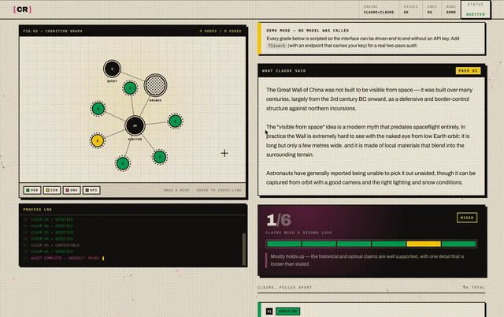

# Cognitive Resistance

**Ask something. Then watch it get checked.**

Every answer takes a second, adversarial pass — Claude auditing Claude, with a live web
search — before you're allowed to just believe it. The audit breaks the answer into
discrete claims and grades each one:

| Tier | Meaning |
| --- | --- |
| `verified` | checked against a real source and confirmed |
| `contestable` | sources disagree, or it depends on unstated context |
| `unverifiable` | no way to confirm it, too vague, or a future prediction |
| `opinion` | stated as fact, but actually a judgement call |

Each claim is staged twice: as a **card** in the feed and as a **node** in a live
force-directed cognition graph. Hovering either one lights the other.



Full walkthrough (58s): `demo/cognitive-resistance-demo-1080p.mp4` — not committed,
see `.gitignore`.

---

## Design

Brutalist structure — hard 2px keylines, offset drop shadows, exposed grid,
mono system labels — printed in a **risograph** treatment: five ink drums
(key, fluorescent pink, federal blue, yellow, green), halftone screens at per-ink
screen angles, deliberate plate misregistration, and animated paper grain.

Everything moves: an ambient node field that reacts to the cursor, a hand-rolled
force simulation with springs, repulsion and collision, audit signal pulses
travelling hub → claim, draw-on SVG edges, scramble-decode text, and a terminal
process log. All of it collapses cleanly under `prefers-reduced-motion` — the
graph solves its layout in one synchronous pass instead of animating there.

---

## Run it

No build step, no dependencies. Any static server:

```bash
python3 -m http.server 8787
# → http://localhost:8787/cognitive-resistance.html
```

It boots in **DEMO mode** — scripted output from `demo-data.js`, no model call,
labelled as such in the masthead and above the results. That exists so the
interface can be driven end to end without a key.

## Going live

The browser cannot hold an Anthropic API key safely, and `api.anthropic.com`
can't be called straight from a page anyway (CORS). Put a tiny server in front
that attaches `x-api-key` and `anthropic-version`, then point the app at it:

```html
<script>
  window.CR_CONFIG = {
    live: true,
    endpoint: '/api/claude',      // your proxy → api.anthropic.com/v1/messages
    model: 'claude-sonnet-4-6'
  };
</script>
```

Load that before `script.js`. `?live=1` also forces live mode against whatever
endpoint is configured.

The proxy needs to forward the request body untouched — pass 2 sends the
`web_search_20250305` server tool, which is what makes the audit adversarial
rather than just a second opinion.

---

## Files

| File | Role |
| --- | --- |
| `cognitive-resistance.html` | markup + inline risograph SVG defs (halftones, ink filters) |
| `style.css` | brutalist/riso design system, tokens, choreography |
| `graph.js` | dependency-free force simulation + SVG cognition graph |
| `riso.js` | grain, ambient lattice, reticle, text scramble, reveals, hero plate |
| `demo-data.js` | scripted output for keyless demos |
| `script.js` | two-pass pipeline + staging |

---

## A caveat worth keeping

The second pass is still Claude. It can miss things, over-flag things, or be
confidently wrong on its own account. Every grade on the page is a prompt to go
check — not a verdict. The interface is built to say so out loud.
